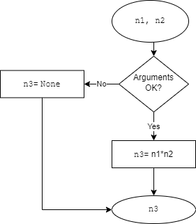

# **`multiply`**

Specification file for `multiply` function.

 

## 1. Requirements
---

### 1.1 ID
---
> f_003

 

### 1.2 Signature
---
> `n3 = multiply(n1, n2)`

 

### 1.3 Type and language
---
> Python function

 

### 1.4 Purpose
---
> Returns the multiplication of n1 and n2 
by successive addition

 

### 1.5 Inputs
---

| Input | Description | Type & Domain |
|---|---|---|
| `n1` | Integer number | *key:integer*   `int`
| `n2` | Integer number | *key:integer*   `int`

 

### 1.6 Outputs
---

| Output | Description | Type & Domain |
|---|---|---|
| `n3` | result of `n1` * `n2` made by successive additions | *key:integer*   `int`

 

## 2. Algorithm
---

